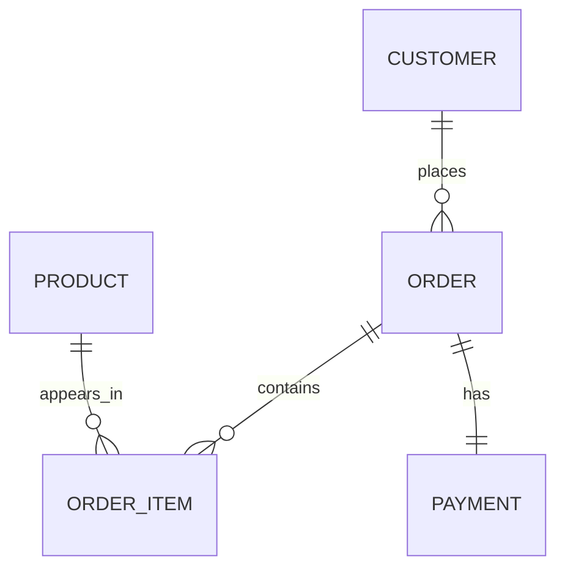
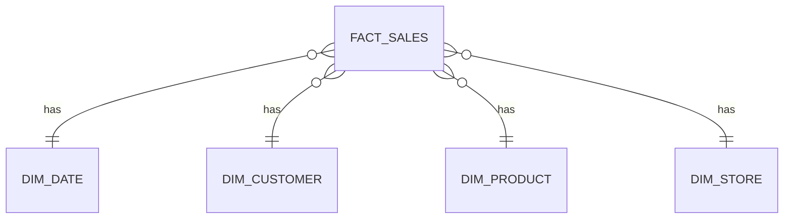

# Data Modeling Notes

These notes explain data modeling in a simple, practical way. The goal is not to memorize definitions, but to understand how data moves from real business activity into tables that are easy to store, trust, and analyze.

## 1. What Is Data Modeling?

Data modeling is the process of designing how data should be organized, connected, stored, and used.

In simple words:

> Data modeling is like drawing the map of your data before building the database.

If a company has customers, orders, products, payments, stores, and employees, data modeling helps us answer questions like:

- Where should customer data be stored?
- How should an order connect to a customer?
- Can one customer place many orders?
- How do we avoid storing the same data again and again?
- How do analysts calculate revenue, profit, or active users correctly?

Good data modeling helps with:

- **Data consistency**: Everyone uses the same meaning for the same data.
- **Scalability**: The system can grow without becoming messy.
- **Performance**: Queries and reports run faster.
- **Cost control**: We avoid unnecessary duplication and inefficient queries.
- **Trust**: Business users trust the numbers because the logic is clear.

## 2. Layers of Data Modeling

Data modeling is usually done in three layers:

```text
Business Idea
    |
    v
Conceptual Model
    |
    v
Logical Model
    |
    v
Physical Model
    |
    v
Database Tables
```

### 2.1 Conceptual Data Model

The conceptual model focuses on the business view.

At this level, we do not worry about column data types, indexes, or SQL scripts. We only try to understand the main business objects and how they relate.

Example:

```text
Customer places Order
Order contains Product
Order has Payment
```

Main focus:

- Business requirements
- Business entities
- KPIs and reporting needs
- High-level relationships

Example questions:

- What is a customer?
- What is an order?
- What is revenue?
- Should cancelled orders be counted in sales?

### 2.2 Logical Data Model

The logical model converts business understanding into entities, attributes, and relationships.

Here we define:

- Tables/entities
- Columns/attributes
- Primary keys
- Foreign keys
- Relationships
- Cardinality
- Normalization rules

Example:

```text
Customer
- customer_id
- customer_name
- email
- phone

Order
- order_id
- customer_id
- order_date
- order_status
```

The logical model is usually shown using an Entity Relationship Diagram, also called an E-R diagram.

### 2.3 Physical Data Model

The physical model is the actual database implementation.

Here we decide:

- Exact table names
- Exact column names
- Data types
- Constraints
- Indexes
- Partitions
- SQL DDL scripts
- Storage details

Example:

```sql
CREATE TABLE customers (
    customer_id BIGINT PRIMARY KEY,
    customer_name VARCHAR(100),
    email VARCHAR(255),
    created_at TIMESTAMP
);

CREATE TABLE orders (
    order_id BIGINT PRIMARY KEY,
    customer_id BIGINT,
    order_date DATE,
    order_status VARCHAR(30),
    FOREIGN KEY (customer_id) REFERENCES customers(customer_id)
);
```

## 3. OLTP Modeling

OLTP means **Online Transaction Processing**.

OLTP systems are used for day-to-day business operations.

Examples:

- Banking transactions
- E-commerce checkout
- Food delivery order placement
- Ticket booking
- Inventory update
- Customer registration

OLTP systems handle many small transactions quickly.

### 3.1 OLTP vs OLAP

| Feature | OLTP | OLAP |
|---|---|---|
| Full form | Online Transaction Processing | Online Analytical Processing |
| Main use | Daily operations | Reporting and analytics |
| Query type | Insert, update, delete, lookup | Aggregation, filtering, joining |
| Data volume per query | Small | Large |
| Users | Applications, operations teams | Analysts, BI users, data scientists |
| Model style | Normalized | Dimensional |
| Example question | Place this order | What was monthly revenue by region? |

Simple example:

An e-commerce website uses OLTP when a customer places an order.

The analytics team uses OLAP when they ask:

> What were the top 10 products by revenue last month?

### 3.2 Requirement Gathering for OLTP

Before creating tables, we need to understand the business process.

A simple method is:

```text
Subject -> Characteristics -> Relations
```

### Subject

A subject is a main business object.

Examples:

- Customer
- Order
- Product
- Payment
- Employee
- Store

Usually, subjects become tables.

### Characteristics

Characteristics describe a subject.

Example:

Customer characteristics:

- customer_id
- name
- email
- phone
- address
- created_date

Usually, characteristics become columns.

### Relations

Relations explain how subjects connect.

Examples:

- One customer can place many orders.
- One order can contain many products.
- One product can appear in many orders.
- One payment belongs to one order.

## 4. Entity Relationship Diagrams

An Entity Relationship Diagram, or E-R diagram, shows tables and relationships visually.

Simple example:



Text version:

```text
Customer 1 ----- many Orders
Order    1 ----- many Order Items
Product  1 ----- many Order Items
Order    1 ----- 1 Payment
```

## 5. Data Types

Data types define what kind of value a column can store.

Choosing the right data type matters because it affects:

- Storage cost
- Query performance
- Data quality
- Validation

### 5.1 Numeric Data Types

Common numeric types:

- `INT`: normal whole numbers.
- `BIGINT`: very large whole numbers, often used for IDs.
- `FLOAT` / `DOUBLE`: approximate decimal values.
- `NUMERIC(10,2)` or `DECIMAL(10,2)`: exact decimal values.

Example:

```sql
order_id BIGINT
quantity INT
price NUMERIC(10,2)
discount_percent FLOAT
```

For money, use `NUMERIC` or `DECIMAL`, not `FLOAT`, because money should be exact.

### 5.2 String Data Types

Common string types:

- `CHAR(n)`: fixed length text.
- `VARCHAR(n)`: variable length text with max size.
- `TEXT`: long text.
- `NVARCHAR`: text that supports Unicode characters in some databases.

Example:

```sql
country_code CHAR(2)
customer_name VARCHAR(100)
product_description TEXT
```

### 5.3 Date and Time Data Types

Common date/time types:

- `DATE`: only date, for example `2026-10-04`.
- `TIME`: only time, for example `14:30:00`.
- `TIMESTAMP`: date and time together.

Example:

```sql
order_date DATE
login_time TIMESTAMP
store_opening_time TIME
```

## 6. Keys in Data Modeling

Keys help us uniquely identify records and create relationships between tables.

### 6.1 Primary Key

A primary key uniquely identifies each row in a table.

Example:

```text
customers
---------
customer_id  customer_name
1            Asha
2            Rahul
```

Here, `customer_id` is the primary key.

Rules:

- It should be unique.
- It should not be null.
- It should not change frequently.

### 6.2 Foreign Key

A foreign key connects one table to another table.

Example:

```text
customers
---------
customer_id  customer_name
1            Asha
2            Rahul

orders
------
order_id  customer_id  order_date
101       1            2026-01-10
102       1            2026-01-12
103       2            2026-01-15
```

In `orders`, `customer_id` is a foreign key that points to `customers.customer_id`.

This means:

- Asha placed order 101 and 102.
- Rahul placed order 103.

### 6.3 Candidate Key

A candidate key is any column or combination of columns that can uniquely identify a row.

Example:

In a customer table:

- `customer_id` can uniquely identify a customer.
- `email` can also uniquely identify a customer, if every customer must have a unique email.

Both can be candidate keys.

### 6.4 Alternate Key

An alternate key is a candidate key that was not chosen as the primary key.

Example:

If `customer_id` is the primary key and `email` is also unique, then `email` is an alternate key.

### 6.5 Super Key

A super key is any set of columns that can uniquely identify a row.

Example:

If `customer_id` alone is unique, then these are also super keys:

- `customer_id`
- `customer_id + email`
- `customer_id + phone`

A super key may contain extra columns that are not needed.

### 6.6 Composite Key

A composite key uses more than one column to uniquely identify a row.

Example:

```text
order_items
-----------
order_id  product_id  quantity
101       10          2
101       11          1
```

Here, one order can have many products. So `order_id + product_id` can be used as a composite key.

### 6.7 Surrogate Key

A surrogate key is an artificial key created by the system.

Example:

```text
customer_sk  customer_id  customer_name
1            CUST1001     Asha
2            CUST1002     Rahul
```

Here:

- `customer_id` may come from the source system.
- `customer_sk` is created inside the data warehouse.

Surrogate keys are very common in OLAP and dimensional modeling, especially for Slowly Changing Dimensions.

## 7. Cardinality

Cardinality means the number of relationships between two entities.

Common types:

- One-to-one
- One-to-many
- Many-to-one
- Many-to-many

### 7.1 One-to-One

One record in table A is related to one record in table B.

Example:

```text
Person 1 ----- 1 Passport
```

One person has one passport, and one passport belongs to one person.

### 7.2 One-to-Many

One record in table A can relate to many records in table B.

Example:

```text
Customer 1 ----- many Orders
```

One customer can place many orders.

### 7.3 Many-to-One

Many records in table A relate to one record in table B.

Example:

```text
Many Orders ----- 1 Customer
```

This is the reverse view of one-to-many.

### 7.4 Many-to-Many

Many records in table A can relate to many records in table B.

Example:

```text
Students many ----- many Courses
```

In a database, many-to-many is usually handled using a bridge table.

Example:

```text
students
student_id

courses
course_id

student_courses
student_id
course_id
```

### 7.5 Crow's Foot vs Chen Model

Both are ways to draw E-R diagrams.

Crow's Foot notation is very popular in database design.

Example:

```text
Customer ||-----o{ Order
```

Meaning:

- One customer can have zero or many orders.
- Each order belongs to one customer.

Chen notation is more academic and uses diamonds for relationships.

Example:

```text
[Customer] ---- <Places> ---- [Order]
```

Simple comparison:

| Notation | Style | Common use |
|---|---|---|
| Crow's Foot | Practical and compact | Database design |
| Chen | Conceptual and academic | Teaching and high-level modeling |

## 8. Normalization

Normalization is the process of organizing tables to reduce duplicate data and improve data integrity.

Simple meaning:

> Store each fact in one place.

Why normalization is useful:

- Reduces duplicate data.
- Avoids update mistakes.
- Keeps data consistent.
- Makes OLTP systems reliable.

Example of bad design:

```text
orders
------
order_id  customer_name  customer_email     product_name  product_price
101       Asha           asha@email.com     Laptop        70000
102       Asha           asha@email.com     Mouse         800
```

Problem:

Customer details are repeated. If Asha changes her email, we must update many rows.

Better design:

```text
customers
---------
customer_id  customer_name  customer_email
1            Asha           asha@email.com

orders
------
order_id  customer_id
101       1
102       1
```

### 8.1 First Normal Form

First Normal Form, or 1NF, means:

- Each column should contain atomic values.
- No repeating groups.
- Each row should be unique.

Bad example:

```text
customer_id  customer_name  phone_numbers
1            Asha           99999,88888
```

Better:

```text
customer_phones
---------------
customer_id  phone_number
1            99999
1            88888
```

### 8.2 Second Normal Form

Second Normal Form, or 2NF, means:

- Table should be in 1NF.
- Non-key columns should depend on the full primary key, not only part of it.

This mainly matters when a table has a composite key.

Bad example:

```text
order_items
-----------
order_id  product_id  product_name  quantity
101       10          Laptop        1
101       11          Mouse         2
```

If the key is `order_id + product_id`, then `product_name` depends only on `product_id`, not the full key.

Better:

```text
products
--------
product_id  product_name
10          Laptop
11          Mouse

order_items
-----------
order_id  product_id  quantity
101       10          1
101       11          2
```

### 8.3 Third Normal Form

Third Normal Form, or 3NF, means:

- Table should be in 2NF.
- Non-key columns should not depend on other non-key columns.

Bad example:

```text
customers
---------
customer_id  customer_name  city_id  city_name
1            Asha           100      Pune
```

Here, `city_name` depends on `city_id`, not directly on `customer_id`.

Better:

```text
customers
---------
customer_id  customer_name  city_id
1            Asha           100

cities
------
city_id  city_name
100      Pune
```

### 8.4 BCNF

BCNF means Boyce-Codd Normal Form.

It is a stricter version of 3NF.

Simple idea:

> Every determinant should be a candidate key.

In real project work, many OLTP systems aim for 3NF. BCNF is useful when there are complex dependency issues.

### 8.5 Denormalization

Denormalization means intentionally adding duplicate or pre-joined data to improve read performance.

Example:

In OLTP, we may store customer and order separately.

In analytics, we may create a table like:

```text
order_report
------------
order_id  customer_name  city_name  product_name  sales_amount
```

This is easier and faster for reporting, but it has duplicate data.

Denormalization is common in:

- Data warehouses
- BI reporting
- Dashboards
- Large analytical tables

## 9. OLAP Modeling

OLAP means **Online Analytical Processing**.

OLAP systems are used for analytics and reporting.

Examples:

- Monthly sales dashboard
- Customer churn analysis
- Product performance report
- Profit by region
- Active users by week

OLAP systems usually read a lot of data and aggregate it.

Example query:

```sql
SELECT
    region,
    DATE_TRUNC('month', order_date) AS order_month,
    SUM(sales_amount) AS revenue
FROM fact_sales
GROUP BY region, DATE_TRUNC('month', order_date);
```

## 10. Dimensional Modeling

Dimensional modeling is a data warehouse design technique that organizes data into:

- Fact tables
- Dimension tables

It is easier for analysts to understand and faster for reporting.

Simple idea:

```text
Facts = numbers we measure
Dimensions = context used to describe those numbers
```

Example question:

> What is revenue by product category, city, and month?

Here:

- Revenue is a fact.
- Product category, city, and month are dimensions.

## 11. Fact Tables

A fact table stores measurable business events.

Examples of facts:

- Sales amount
- Quantity sold
- Discount amount
- Profit
- Tax amount
- Page views
- Order count

Example:

```text
fact_sales
----------
sales_key
date_key
product_key
customer_key
store_key
quantity
sales_amount
discount_amount
profit_amount
```

Fact tables usually contain:

- Foreign keys to dimensions
- Numeric measures
- Event-level or aggregated data

### 11.1 Grain of a Fact Table

Grain means the level of detail stored in the fact table.

Example:

```text
One row per order item
```

or

```text
One row per customer per day
```

Choosing the grain is one of the most important decisions in dimensional modeling.

If the grain is unclear, reports can become incorrect.

## 12. Dimension Tables

A dimension table stores descriptive information.

Examples:

- Customer
- Product
- Date
- Store
- Geography
- Employee

Example:

```text
dim_product
-----------
product_key
product_id
product_name
brand
category
subcategory
start_date
end_date
is_current
```

Dimensions are used for filtering, grouping, and labeling reports.

Example:

```sql
SELECT
    p.category,
    SUM(f.sales_amount) AS revenue
FROM fact_sales f
JOIN dim_product p
    ON f.product_key = p.product_key
GROUP BY p.category;
```

## 13. KPIs

KPI means Key Performance Indicator.

A KPI is a business metric used to measure performance.

Examples:

- Revenue
- Profit
- Gross margin
- Active customers
- Average order value
- Conversion rate
- Customer retention
- Inventory turnover

Good data models make KPI logic clear.

Example:

```text
Revenue = SUM(sales_amount)
Profit = SUM(sales_amount - cost_amount)
Average Order Value = Revenue / Number of Orders
```

Important point:

Before designing a data warehouse, always understand the KPIs. The model should support the questions the business actually asks.

## 14. From OLTP Tables to OLAP Tables

In many real projects, data starts in normalized OLTP tables.

Then data engineers transform it into analytics-friendly OLAP tables.

Flow:

```text
OLTP normalized tables
        |
        v
Raw/Staging tables
        |
        v
One Big Joined Table
        |
        v
Fact and Dimension tables
        |
        v
Dashboards and analytics
```

Example OLTP tables:

```text
customers
orders
order_items
products
payments
stores
```

One big joined table:

```text
order_id
order_date
customer_id
customer_name
city
product_id
product_name
category
store_id
store_name
quantity
sales_amount
payment_method
```

Then split into dimensional model:

```text
fact_sales
- date_key
- customer_key
- product_key
- store_key
- quantity
- sales_amount

dim_customer
- customer_key
- customer_id
- customer_name
- city

dim_product
- product_key
- product_id
- product_name
- category

dim_store
- store_key
- store_id
- store_name
- city

dim_date
- date_key
- date
- month
- quarter
- year
```

## 15. Star Schema

A star schema has one fact table in the center and dimension tables around it.

Diagram:

```text
                    dim_date
                       |
                       |
dim_customer ---- fact_sales ---- dim_product
                       |
                       |
                    dim_store
```

Mermaid version:



Star schema is popular because:

- Easy to understand.
- Faster for reporting.
- Simple joins.
- Good for BI tools.

## 16. Snowflake Schema

A snowflake schema is like a star schema, but dimensions are normalized into smaller tables.

Example:

```text
fact_sales
    |
dim_product
    |
dim_category
```

In star schema, category may be stored inside `dim_product`.

In snowflake schema, category is separated into its own table.

Comparison:

| Feature | Star Schema | Snowflake Schema |
|---|---|---|
| Dimension design | Denormalized | Normalized |
| Joins | Fewer | More |
| Query performance | Usually faster | Can be slower |
| Storage | More duplicate data | Less duplicate data |
| Simplicity | Easier | More complex |
| BI friendliness | High | Medium |

## 17. Slowly Changing Dimensions

Slowly Changing Dimensions, or SCD, are techniques for handling changes in dimension data over time.

Example:

A customer lives in Pune today. Next year, the customer moves to Bangalore.

Question:

Should old sales reports show the customer as Pune or Bangalore?

The answer depends on the business requirement.

### 17.1 SCD Type 1

Type 1 overwrites old data.

Example before:

```text
customer_id  customer_name  city
101          Asha           Pune
```

After city change:

```text
customer_id  customer_name  city
101          Asha           Bangalore
```

Old value is lost.

Use Type 1 when history is not important.

Example use cases:

- Correcting spelling mistakes
- Updating phone number
- Fixing wrong email

### 17.2 SCD Type 2

Type 2 preserves history by adding a new row.

Example:

```text
customer_key  customer_id  customer_name  city       start_date  end_date    is_current
1             101          Asha           Pune       2024-01-01  2026-03-31  N
2             101          Asha           Bangalore  2026-04-01  9999-12-31  Y
```

Here:

- `customer_id` is the business key from source.
- `customer_key` is the surrogate key.
- `start_date` and `end_date` show record validity.
- `is_current` tells which row is active now.

Use Type 2 when historical reporting matters.

Example:

Sales made while Asha lived in Pune should still show under Pune.

### 17.3 SCD Type 3

Type 3 stores limited history using extra columns.

Example:

```text
customer_id  customer_name  current_city  previous_city
101          Asha           Bangalore     Pune
```

This keeps only limited history.

Use Type 3 when only previous value is required.

## 18. Medallion Architecture

Medallion architecture is a common data lakehouse design pattern.

It usually has three layers:

```text
Bronze -> Silver -> Gold
```

### 18.1 Bronze Layer

Bronze stores raw data as received from source systems.

Characteristics:

- Minimal transformation
- Mostly append-only
- Used for audit and replay
- May contain duplicates or dirty data

Example:

```text
bronze_orders_raw
bronze_customers_raw
```

### 18.2 Silver Layer

Silver stores cleaned and standardized data.

Activities:

- Remove duplicates
- Standardize column names
- Fix data types
- Apply basic validations
- Join related source data when needed

Example:

```text
silver_orders
silver_customers
silver_products
```

### 18.3 Gold Layer

Gold stores business-ready data for analytics.

This is where dimensional models are often created.

Example:

```text
gold_fact_sales
gold_dim_customer
gold_dim_product
gold_sales_monthly_summary
```

Diagram:

```text
Source Systems
      |
      v
Bronze Layer
Raw data, as-is
      |
      v
Silver Layer
Cleaned and standardized data
      |
      v
Gold Layer
Business-ready facts, dimensions, KPIs
      |
      v
Reports, dashboards, ML, analytics
```

## 19. Example End-to-End Data Model

Let us design a simple sales analytics model.

Business questions:

- What is total revenue by month?
- Which product category sells the most?
- Which city has the highest sales?
- Who are the top customers?

OLTP source tables:

```text
customers(customer_id, name, email, city)
orders(order_id, customer_id, order_date, store_id)
order_items(order_id, product_id, quantity, unit_price)
products(product_id, product_name, category)
stores(store_id, store_name, city)
```

Gold dimensional model:

```text
fact_sales
----------
sales_key
date_key
customer_key
product_key
store_key
order_id
quantity
unit_price
sales_amount

dim_customer
------------
customer_key
customer_id
customer_name
email
city

dim_product
-----------
product_key
product_id
product_name
category

dim_store
---------
store_key
store_id
store_name
city

dim_date
--------
date_key
date
day
month
quarter
year
```

Star schema:

```text
                    dim_date
                       |
                       |
dim_customer ---- fact_sales ---- dim_product
                       |
                       |
                    dim_store
```

Example KPI query:

```sql
SELECT
    d.year,
    d.month,
    SUM(f.sales_amount) AS revenue
FROM fact_sales f
JOIN dim_date d
    ON f.date_key = d.date_key
GROUP BY d.year, d.month
ORDER BY d.year, d.month;
```

## 20. Common Data Modeling Mistakes

### Not defining the grain

If we do not define the grain of a fact table, metrics may get duplicated.

Bad:

> fact_sales stores sales data.

Better:

> fact_sales has one row per order item.

### Mixing facts and dimensions

Facts are measurable numbers. Dimensions are descriptive context.

Example:

- `sales_amount` is a fact.
- `product_category` is a dimension attribute.

### Using source IDs directly as warehouse keys

In dimensional modeling, source IDs can change or collide across systems.

Better approach:

- Keep source ID as business key.
- Create a surrogate key for warehouse joins.

### Not handling historical changes

If customer city, product category, or sales region changes, reports may become wrong unless SCD rules are clear.

### Over-normalizing analytics tables

Highly normalized models are good for OLTP, but they can make analytics slow and difficult.

For analytics, star schema is often simpler and better.

## 21. Quick Revision

```text
Data Modeling
    |
    |-- Conceptual: business view
    |-- Logical: entities, columns, keys, relationships
    |-- Physical: actual database implementation

OLTP
    |
    |-- Operational systems
    |-- Fast inserts, updates, deletes
    |-- Normalized tables

OLAP
    |
    |-- Analytics and reporting
    |-- Fast reads and aggregations
    |-- Fact and dimension tables

Fact Table
    |
    |-- Stores measurements
    |-- Example: sales_amount, quantity, profit

Dimension Table
    |
    |-- Stores context
    |-- Example: customer, product, date, store

SCD
    |
    |-- Type 1: overwrite
    |-- Type 2: add new row and preserve history
    |-- Type 3: keep limited previous value in columns
```

## 22. Types of Fact Tables

Fact tables are not always designed in the same way. The design depends on what business event or process we are tracking.

### 22.1 Transaction Fact Table

A transaction fact table stores one row for each business event.

Example grain:

```text
One row per order item.
```

Example:

```text
fact_sales_transaction
----------------------
order_id
product_key
customer_key
date_key
quantity
sales_amount
```

Use transaction fact tables for:

- Sales
- Payments
- Orders
- Clicks
- Bookings

This is the most common type of fact table.

### 22.2 Periodic Snapshot Fact Table

A periodic snapshot fact table stores measurements at regular time intervals.

Example grain:

```text
One row per product per store per day.
```

Example:

```text
fact_inventory_daily
--------------------
date_key
product_key
store_key
stock_quantity
inventory_value
```

Use periodic snapshot fact tables for:

- Daily inventory
- Monthly account balance
- Weekly active users
- Daily subscription count

### 22.3 Accumulating Snapshot Fact Table

An accumulating snapshot fact table tracks a process from start to finish.

Example process:

```text
Order placed -> Packed -> Shipped -> Delivered
```

Example:

```text
fact_order_pipeline
-------------------
order_id
order_date_key
packed_date_key
shipped_date_key
delivered_date_key
days_to_ship
days_to_deliver
```

Use accumulating snapshot fact tables for:

- Order delivery lifecycle
- Loan approval process
- Support ticket resolution
- Recruitment pipeline

### 22.4 Factless Fact Table

A factless fact table does not store numeric measures. It only stores keys to show that an event happened or that a relationship exists.

Example:

```text
fact_student_attendance
-----------------------
date_key
student_key
class_key
```

There is no amount or quantity here. The row itself means the student attended the class.

Use factless fact tables for:

- Attendance
- Event participation
- Coverage tables
- Eligibility tracking

## 23. Conformed Dimensions and Bridge Tables

### 23.1 Conformed Dimensions

A conformed dimension is a dimension that is shared across multiple fact tables.

Example:

```text
fact_sales uses dim_product
fact_inventory uses dim_product
fact_returns uses dim_product
```

Diagram:

```text
fact_sales --------\
fact_inventory ---- >---- dim_product
fact_returns ------/
```

Why this is useful:

If sales, inventory, and returns all use the same `dim_product`, then product category, brand, and product name mean the same thing everywhere.

This helps business users compare metrics correctly.

Example business question:

```text
Show sales, returns, and inventory by product category.
```

This works cleanly when `dim_product` is conformed.

### 23.2 Bridge Tables

A bridge table handles many-to-many relationships.

Example:

One customer can belong to many segments.

One segment can have many customers.

```text
dim_customer
------------
customer_key
customer_name

dim_segment
-----------
segment_key
segment_name

bridge_customer_segment
-----------------------
customer_key
segment_key
```

Diagram:

```text
dim_customer ---- bridge_customer_segment ---- dim_segment
```

Another example:

One order can use many promotions, and one promotion can apply to many orders.

```text
fact_order ---- bridge_order_promotion ---- dim_promotion
```

Bridge tables are important because many-to-many relationships can create duplicate rows and wrong totals if they are not modeled carefully.

## 24. Data Warehouse Layers, Data Marts, and Source-to-Target Mapping

### 24.1 Data Warehouse Layers

A data warehouse usually has multiple layers so that raw data, cleaned data, and business-ready data do not get mixed.

Common flow:

```text
Source Systems
      |
      v
Staging / Bronze
      |
      v
Silver
      |
      v
Gold
      |
      v
Data Marts / BI Reports
```

### 24.2 Staging or Bronze Layer

This layer stores raw data from source systems.

Example:

```text
bronze_orders_raw
bronze_customers_raw
bronze_payments_raw
```

It is useful for:

- Auditing
- Reprocessing
- Debugging
- Keeping source history

### 24.3 Silver Layer

This layer stores cleaned and standardized data.

Common work in silver:

- Remove duplicates
- Fix data types
- Standardize column names
- Apply basic quality rules
- Join or prepare source-level entities

Example:

```text
silver_orders
silver_customers
silver_products
```

### 24.4 Gold Layer

This layer stores business-ready data.

Gold tables are usually consumed by dashboards, analysts, and business users.

Example:

```text
gold_fact_sales
gold_dim_customer
gold_dim_product
gold_sales_monthly_summary
```

### 24.5 Data Marts

A data mart is a smaller analytics area designed for a specific business team or subject.

Examples:

- Sales data mart
- Finance data mart
- Marketing data mart
- HR data mart

Simple structure:

```text
Enterprise Data Warehouse
        |
        v
Sales Data Mart
Finance Data Mart
Marketing Data Mart
```

Why data marts are useful:

- They are easier for business teams to use.
- They focus on one department or subject area.
- They improve access control.
- They make dashboards simpler.

### 24.6 Source-to-Target Mapping

Source-to-target mapping explains how source columns become target columns.

It is like a blueprint for ETL or ELT development.

Example:

| Source table | Source column | Target table | Target column | Transformation |
|---|---|---|---|---|
| orders | order_id | fact_sales | order_id | Direct mapping |
| orders | order_date | dim_date | date | Extract date details |
| order_items | quantity | fact_sales | quantity | Direct mapping |
| order_items | quantity, unit_price | fact_sales | sales_amount | quantity * unit_price |
| customers | customer_id | dim_customer | customer_id | Direct mapping |
| customers | city | dim_customer | city | Standardize city name |

Why this matters:

- Developers know what to build.
- Testers know what to validate.
- Business users understand where numbers come from.
- Data lineage becomes easier to explain.

## 25. Data Vault

Data Vault is a data warehouse modeling technique designed for flexibility, auditability, and historical tracking.

It has three main parts:

- Hubs
- Links
- Satellites

Simple meaning:

```text
Hub = business key
Link = relationship
Satellite = descriptive history
```

Example hub:

```text
hub_customer
------------
customer_hk
customer_id
load_date
source_system
```

Example link:

```text
link_customer_order
-------------------
customer_order_hk
customer_hk
order_hk
load_date
source_system
```

Example satellite:

```text
sat_customer_details
--------------------
customer_hk
customer_name
email
city
load_date
end_date
source_system
```

Data Vault is useful when:

- There are many source systems.
- Source structures change often.
- Full history is required.
- Auditability is important.

## 26. One Big Table

One Big Table, or OBT, is a wide table that already contains many joined columns.

Example:

```text
sales_obt
---------
order_id
order_date
customer_id
customer_name
customer_city
product_id
product_name
category
store_id
store_city
quantity
sales_amount
```

Benefits:

- Easy for analysts
- Fewer joins
- Simple for BI dashboards
- Can perform well in modern columnar warehouses

Problems:

- Data can be repeated many times.
- Table can become very wide.
- Business logic can become harder to maintain.
- It may not be reusable like proper dimensions.

Simple rule:

```text
Use dimensional modeling for clean reusable structure.
Use OBT when simplicity and dashboard performance are more important.
```

## 27. Late-Arriving Dimensions

A late-arriving dimension happens when fact data arrives before dimension data.

Example:

```text
An order arrives today with customer_id C500.
But customer details for C500 arrive tomorrow.
```

Problem:

The fact table needs a `customer_key`, but the matching customer record does not exist in `dim_customer` yet.

Common solution:

Create a placeholder dimension record.

Example:

```text
customer_key  customer_id  customer_name  city      is_unknown
-1            C500         Unknown        Unknown   Y
```

Later, when customer details arrive, update the dimension:

```text
customer_key  customer_id  customer_name  city    is_unknown
-1            C500         Neha           Mumbai  N
```

Why this matters:

- Fact loading does not fail.
- Reports can still include the transaction.
- Missing dimension details can be fixed later.

## 28. Schema Evolution

Schema evolution means the structure of data changes over time.

Examples:

- A new column is added.
- A column data type changes.
- A nested JSON field appears.
- A source system removes a column.

Example:

Old customer data:

```text
customer_id
customer_name
email
```

New customer data:

```text
customer_id
customer_name
email
phone_number
```

Good practices:

- Add new columns carefully.
- Keep backward compatibility when possible.
- Track schema versions.
- Validate required columns.
- Avoid suddenly breaking downstream dashboards.
- Communicate changes to BI and analytics users.

In lakehouse systems, formats like Delta Lake can support controlled schema evolution, but the data engineer still needs to decide whether the change makes business sense.

## 29. Final Practical Advice

When designing a data model, always ask:

- What business process are we modeling?
- What questions should the data answer?
- What is the grain of the table?
- Which columns are facts?
- Which columns are dimensions?
- Do we need history?
- Is this for transactions or analytics?

Good data modeling is not only about tables. It is about making business meaning clear, reliable, and usable.

## 30. Simple Interview-Style Answers

### What is data modeling?

Data modeling is the process of designing how data is organized, related, and stored. It helps create databases and data warehouses that are consistent, scalable, and easy to use.

### What is the difference between OLTP and OLAP?

OLTP is used for daily transactions like placing orders or updating payments. OLAP is used for analytics and reporting, such as calculating monthly revenue or sales by region.

### What is normalization?

Normalization is organizing data into multiple related tables to reduce duplicate data and improve data consistency.

### What is denormalization?

Denormalization is intentionally combining or duplicating data to make read queries faster, mainly in analytics systems.

### What is a fact table?

A fact table stores measurable business events, such as sales amount, quantity, profit, or order count.

### What is a dimension table?

A dimension table stores descriptive context for facts, such as customer, product, date, location, or store.

### What is a star schema?

A star schema is a dimensional model where one fact table is connected to multiple dimension tables. It is simple and good for reporting.

### What is a surrogate key?

A surrogate key is an artificial key generated inside the system. It is commonly used in data warehouses to uniquely identify dimension records and manage history.

### What is SCD Type 2?

SCD Type 2 preserves historical changes by inserting a new row whenever important dimension attributes change. It usually uses surrogate keys, start dates, end dates, and current flags.
