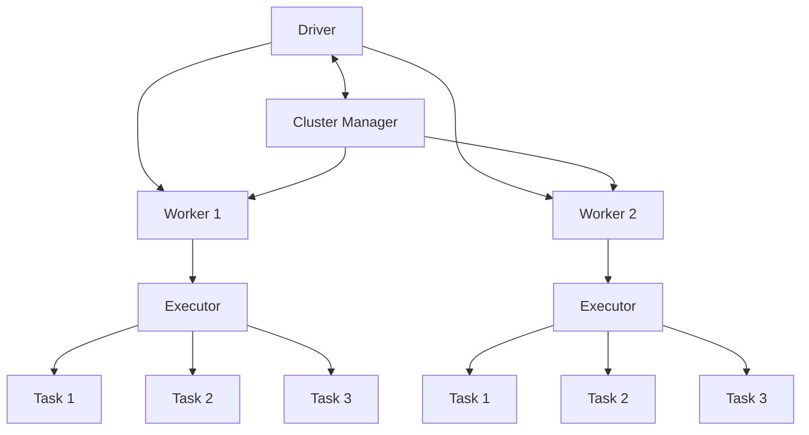
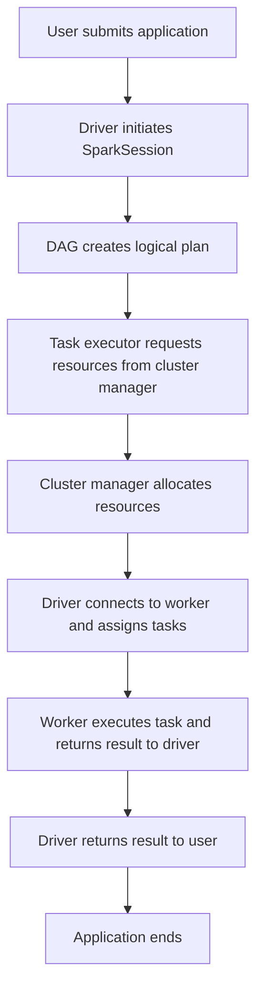
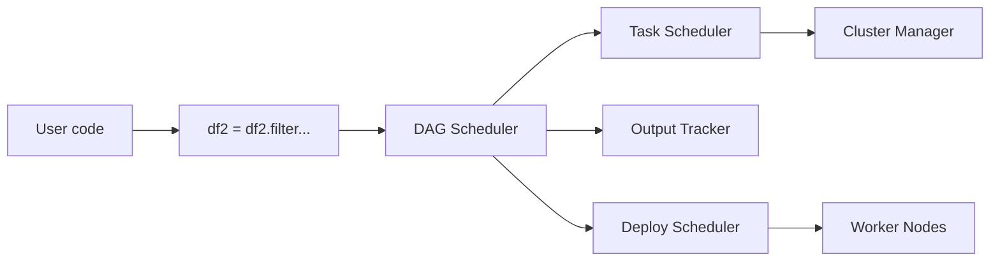
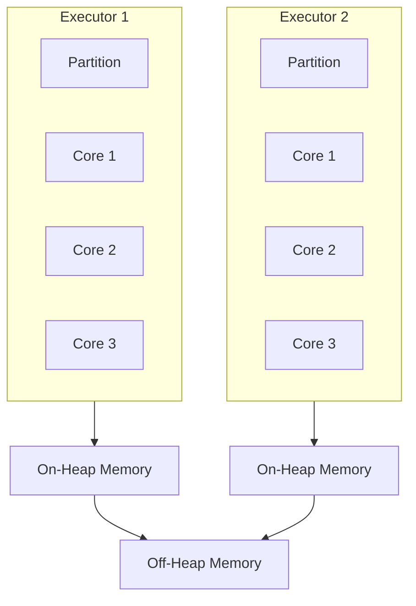
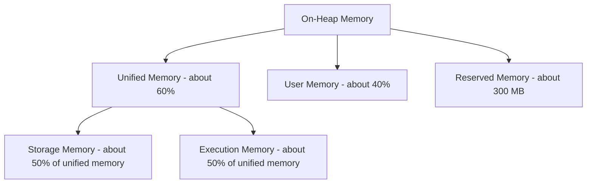
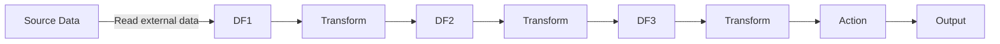
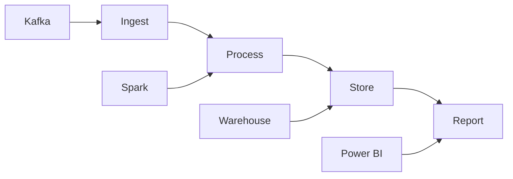
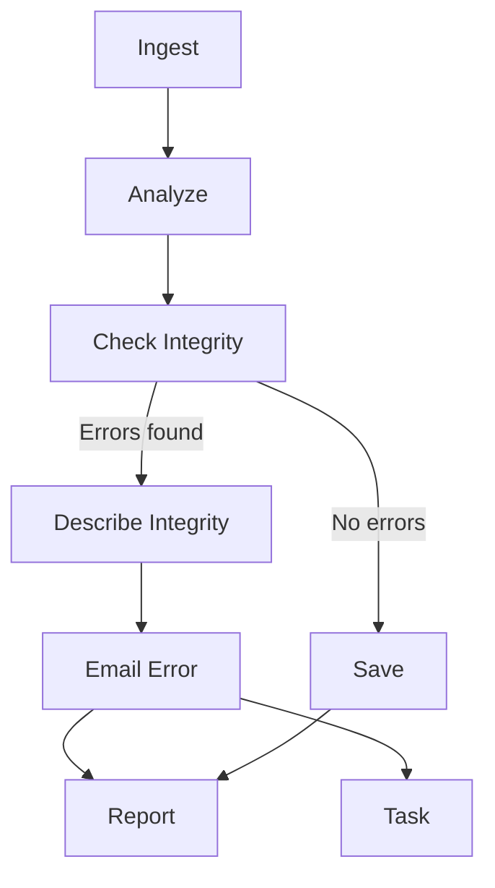

# Spark Notes

These notes cover Spark architecture, PySpark APIs, data handling, optimization, Airflow basics, and common interview-style topics.

## Table of Contents

- [Apache Spark Overview](#apache-spark-overview)
- [Spark Architecture](#spark-architecture)
- [Spark Application Lifecycle](#spark-application-lifecycle)
- [Core Terminology](#core-terminology)
- [Driver and Worker Node Architecture](#driver-and-worker-node-architecture)
- [Memory Architecture](#memory-architecture)
- [Transformations, Actions, and DAGs](#transformations-actions-and-dags)
- [Clusters and Data Loading](#clusters-and-data-loading)
- [PySpark DataFrame Operations](#pyspark-dataframe-operations)
- [Partitioning and Persistence](#partitioning-and-persistence)
- [Catalyst Optimizer](#catalyst-optimizer)
- [Rule-Based vs Cost-Based Optimization](#rule-based-vs-cost-based-optimization)
- [Airflow Overview](#airflow-overview)
- [Broadcast Variables and AQE](#broadcast-variables-and-aqe)
- [UDFs and Data Skew](#udfs-and-data-skew)
- [Shuffle Partitions](#shuffle-partitions)
- [Autoscaling and Checkpointing](#autoscaling-and-checkpointing)
- [Compression: Snappy vs Gzip](#compression-snappy-vs-gzip)
- [Useful PySpark Functions](#useful-pyspark-functions)
- [Jobs, Stages, and Execution Plans](#jobs-stages-and-execution-plans)
- [Join Strategies and Bucketing](#join-strategies-and-bucketing)

## Apache Spark Overview

Apache Spark is an open-source distributed computing engine used for processing and analyzing large amounts of data.

Spark is similar to Hadoop in that both work with distributed data, but Spark is more mature for in-memory processing. Compared with Hadoop or traditional systems, Spark can be much faster because it uses memory and parallel processing instead of depending mainly on disk.

Spark has a layered architecture. Its main layers are:

- Driver
- Workers
- Cluster manager

These layers are designed with clear boundaries and are loosely coupled.

## Spark Architecture



Best practice: keep Spark partitions as a multiple of the number of cores.

## Spark Application Lifecycle



Tasks are assigned in the form of JAR files. The driver returns the result to the user, then the application ends.

## Core Terminology

### Driver and Worker

Driver and worker processes are JVM processes.

A JVM, or Java Virtual Machine, is a software platform that allows Java programs and JVM-compatible languages such as Scala and Kotlin to run on different devices and operating systems. It provides an abstraction layer that converts Java bytecode into machine code.

### Application

An application can be a single command or a group of notebooks containing complex logic. When code is submitted to Spark for execution, the application starts.

### Job

When an application is submitted to Spark, the driver converts code into jobs. Each action triggers at least one Spark job.

### Stage

Jobs are divided into stages. If the application code requires shuffling data across nodes, Spark creates a new stage. The number of stages is determined by shuffle operations such as joins.

### Task

Stages are further divided into tasks. In a stage, each task executes the same logic, and each task processes one partition at a time. The number of partitions in a distributed cluster determines the number of tasks in that stage.

### Transformation

A transformation converts input RDDs or DataFrames into new RDDs or DataFrames. Transformations are lazily evaluated until an action is called.

Examples: `map`, `filter`, `union`.

### Action

An action triggers real execution. It returns data to the driver or writes data to storage.

Examples: `count`, `collect`, `save`.

### DAG

DAG stands for Directed Acyclic Graph. Spark uses a DAG to track transformations, build logical plans, and maintain lineage.

### RDD

RDD stands for Resilient Distributed Dataset. It is the basic distributed data structure in Spark. When Spark reads or creates data, it distributes it across nodes in the form of partitions.

### Executor

Each worker node can have multiple executors. Executors are configurable and run tasks assigned by Spark.

### Partition

A DataFrame is stored in memory across the cluster as partitions. Tasks usually work on subsets of partitions.

### Core

Each executor can have multiple cores. A core is configurable, and each core processes one task at a time.

### Heap and Off-Heap Memory

- On-heap memory: executor memory inside the JVM process, managed by JVM garbage collection.
- Off-heap memory: executor memory outside the JVM process, managed by the operating system.

## Spark Libraries and Languages

Spark includes several libraries:

- SQL
- Streaming
- MLlib
- GraphX

Common languages:

- Scala
- Java
- Python
- SQL
- R

## Driver and Worker Node Architecture

### Driver Node Architecture



### Worker Node Architecture



Each worker node contains multiple executors. Executors are independent JVM processes that run Spark tasks and store data in memory or disk as required.

### Executor Components

- Cores: each executor receives CPU cores for parallel task execution.
- On-heap memory: managed by the JVM and used for computation, caching, and immediate data.
- Off-heap memory: managed outside the JVM heap and used for advanced memory optimization, caching, and serialized data.
- Executors communicate through off-heap memory and during shuffle, aggregation, and other data processing steps.

## Memory Architecture

Spark memory is split into:

- Unified memory: around 60% of heap memory.
- User memory: around 40% of heap memory.
- Reserved memory: about 300 MB, not accessible for computation or storage.



- Storage memory caches data such as RDDs and DataFrames for faster access.
- Execution memory is used for computation tasks.
- User memory stores user variables and temporary data during execution.

Optimization notes:

- Storage memory can borrow from execution memory when it is not fully used, and vice versa.
- Proper heap and unified memory tuning helps avoid out-of-memory errors and improves job performance.

## Transformations, Actions, and DAGs

### Transformations

Transformations change data from one form to another and create a new DataFrame or RDD after execution. They are lazily evaluated through Spark's DAG.

### Actions

Actions trigger actual execution and return data to the driver or write it to storage.

### Lazy Evaluation and DAG



The DAG is updated after every transformation. Execution happens only when an action is called.

### Narrow Transformations

A narrow transformation is one where each input partition contributes to only one output partition. No data is shuffled across nodes, so it is faster.

Examples: `map`, `filter`, `union`.

### Wide Transformations

A wide transformation is one where each input partition contributes to multiple output partitions. Data is shuffled across the cluster so Spark can repartition correctly.

Examples: `join`, `sortBy`.

## Clusters and Data Loading

### What Is a Cluster?

A Spark cluster is a group of computers, or nodes, that work together to process large-scale workloads. It provides resources such as CPU, memory, and storage for distributed applications.

### Read CSV Syntax

```python
df = (
    spark.read.format("file_type")
    .option("inferSchema", "true")
    .option("header", "true")
    .option("sep", ",")
    .schema(schema_df)
    .load("file_location")
)
```

Common options:

- `header=True`: use the first row as column names.
- `inferSchema=True`: infer schema automatically from data.
- `sep=","`: specify delimiter.
- `schema`: provide an explicit schema. This is preferred for large data.
- `load(path)`: load data from a file or folder path.

Common formats:

- CSV
- Parquet
- ORC
- JSON
- Avro

## PySpark DataFrame Operations

### `explode`

`explode` transforms array or map columns into separate rows.

```python
df.select(explode("column_name"))
```

Useful for flattening nested JSON structures.

### `withColumn`

```python
df.withColumn(
    "new_column",
    when(condition1, value1)
    .when(condition2, value2)
    .otherwise(default_value),
)
```

### `union` and `unionAll`

- `union`: combines two DataFrames with matching schemas and removes duplicate records from the result in older Spark versions. In Spark 2.0+, duplicates are not removed automatically, so use `dropDuplicates()` when needed.
- `unionAll`: same as union but retains duplicates.

```python
df_union = df1.union(df2)
df_union_all = df1.unionAll(df2)
```

### Pivot and Unpivot

Pivot converts rows into columns.

```python
df_pivot = (
    df.groupBy("name", "year")
    .pivot("category")
    .agg(sum("sales"))
)
```

Unpivot converts columns back into rows. In PySpark, it can be done using `stack`.

```python
df_unpivot = df_pivot.selectExpr(
    "name",
    "year",
    "stack(2, 'Electronics', Electronics, 'Clothing', Clothing) as (category, sales)",
).where("sales IS NOT NULL")
```

### Flatten Complex JSON

```python
df = spark.read.option("multiline", "true").json("file_path")
```

Useful options:

- `multiline=True`: use when JSON has multiple lines per record.
- `inferSchema=True`: infer schema automatically.
- `mode="FAILFAST"`: throw an error if JSON is corrupted.
- `mode="PERMISSIVE"`: default; sets problematic fields to `NULL`.

Handling nested JSON:

| Situation | Solution |
| --- | --- |
| Simple nested fields | Use dot notation, for example `df.select(col("field.nested_field"))` |
| Nested arrays | Use `explode`, for example `df.select(explode(col("arrayField")))` |
| Deeply nested JSON | Use dot notation and `explode` together |

### Bad Record Handling

PySpark handles corrupt data using these modes:

- `PERMISSIVE`: includes corrupt records in a separate column. This is the default mode.
- `DROPMALFORMED`: ignores corrupt records and excludes them from output.
- `FAILFAST`: throws an exception as soon as a corrupt record is encountered.

## Spark Streaming

Streaming concepts:

- `readStream`: read streaming data.
- `writeStream`: write streaming data.
- Checkpoint: important for fault tolerance and incremental stream processing pipelines. Spark stores intermediate state in HDFS-compatible storage to recover from failure.
- Trigger: controls when streaming data is processed. Options include default, fixed interval, and one-time triggers.
- Output mode: `append`, `complete`, and `update`.

Standard streaming architecture:



## Partitioning and Persistence

### Why Partition Strategy Matters

A good partition strategy is crucial for Spark performance because it controls how data is distributed across worker nodes.

Benefits:

- Better performance: partitioning directly affects speed and efficiency.
- Right number of partitions: align partitions with available cores.
- Even partitioning: balanced partitions share work across nodes efficiently.

Too few partitions can leave cores idle. Too many partitions can create excessive overhead.

### `repartition` vs `coalesce`

#### `repartition`

- Increases or decreases partitions.
- Performs a full shuffle.
- Useful when data is skewed or needs redistribution.
- Use when more partitions are needed for parallelism.

```python
df = df.repartition(5)
```

#### `coalesce`

- Only decreases partitions.
- Avoids full shuffle by merging existing partitions.
- Best when reducing partitions without needing even redistribution.
- Useful before writing output or when minimizing shuffle cost.

```python
df = df.coalesce(5)
```

### `cache` vs `persist`

Both store intermediate results to avoid recomputation and improve performance.

#### `cache`

- Memory-only storage.
- Stores DataFrame or RDD in memory.
- Uses default storage level `MEMORY_ONLY`.
- Recomputes partitions if memory is not enough.

#### `persist`

- Allows flexible storage levels such as memory, disk, or both.
- Can store to disk if memory is full.
- Gives more control over data persistence.
- Useful for expensive transformations and large datasets.

Common storage levels:

| Storage Level | Description |
| --- | --- |
| `MEMORY_ONLY` | Default, same as `cache` |
| `MEMORY_AND_DISK` | Stores in memory and spills to disk if needed |
| `DISK_ONLY` | Stores only on disk |
| `MEMORY_ONLY_SER` | Serialized storage; uses less memory but more CPU |
| `OFF_HEAP` | Stores outside JVM heap for large-scale processing |

## Catalyst Optimizer

Catalyst Optimizer is Spark SQL's optimizer for DataFrame and SQL queries. It automatically finds efficient ways to execute operations in user code.

It transforms and optimizes logical execution plans before running queries. It applies logical optimization, physical optimization, and code generation.

### How Catalyst Works

1. Analysis phase
   - Checks column names, data types, and functions.
   - Resolves references using the table schema.
   - Converts SQL or PySpark expressions into an unresolved logical plan.

2. Logical optimization phase
   - Predicate pushdown: moves filter conditions close to the data source.
   - Constant folding: precomputes constant expressions.
   - Projection pruning: removes unnecessary columns.
   - Reordering joins: uses statistics to optimize join order.

3. Physical optimization phase
   - Selects the best execution plan, such as broadcast join, shuffle hash join, or sort-merge join.
   - Uses whole-stage code generation to compile transformations into efficient Java bytecode.

4. Code generation
   - Uses the Tungsten engine to optimize memory usage and CPU efficiency.
   - Generates low-level Java bytecode for execution.

Check optimized plans with:

```python
df.explain(True)
```

## Rule-Based vs Cost-Based Optimization

### Rule-Based Optimization

Rule-based optimization uses predefined logical rules without analyzing data statistics.

Examples:

- Reordering filters for better performance.
- Projection pruning to remove unused columns.
- Constant folding to evaluate constant expressions at compile time.

Pros:

- Fast and deterministic.
- No table statistics required.

Cons:

- Does not consider data distribution.
- May not produce the best query plan.

### Cost-Based Optimization

Cost-based optimization uses table statistics and data distribution to choose the most efficient plan.

It requires table statistics, usually collected with:

```sql
ANALYZE TABLE table_name COMPUTE STATISTICS;
```

Examples:

- Join reordering based on table size.
- Broadcast join decisions.
- Aggregate pushdown.
- Data skew handling.
- Partition pruning.

Pros:

- Finds better query plans based on statistics.
- Reduces shuffle and improves performance.
- Adapts to data size and distribution.

Cons:

- Requires table statistics.
- Adds overhead to collect statistics.
- Can be slower for dynamic data.

| Scenario | Prefer | Why |
| --- | --- | --- |
| Simple query | RBO | Predefined rules work well |
| Complex joins | CBO | Optimizes join order and broadcast decisions |
| Small datasets | RBO | No need for cost-based planning |
| Large datasets | CBO | Helps with partition pruning and join strategy |

## Airflow Overview

Airflow is a platform to build and run workflows. A workflow is represented as a DAG containing individual pieces of work called tasks. DAGs define task dependencies and the order in which tasks execute.



Airflow tasks can run Python code, shell commands, or other high-level operations. Airflow is not limited to a particular tech stack.

### Airflow Components

Required components:

- Scheduler: handles triggering scheduled workflows and submitting tasks to executors. It runs inside the scheduler process.
- Webserver: provides a UI to inspect, trigger, and debug DAGs and task behavior.
- DAG folder: read by the scheduler to determine which tasks to run and when.
- Metadata database: stores state of workflows and tasks. Airflow requires a metadata database to work.

Optional components:

- Worker: in basic installations it may not be a separate component.
- Triggerer: executes deferred tasks in an async event loop.
- DAG processor: parses DAG files and serializes them into the metadata database.
- Plugins folder: extends Airflow functionality.

## Broadcast Variables and AQE

### Broadcast Variable

A broadcast variable is a Spark programming mechanism that keeps a read-only copy of data on each cluster node instead of sending the data to each node every time a task needs it.

### Adaptive Query Execution

Adaptive Query Execution, or AQE, is a Spark performance optimization feature that dynamically optimizes query plans at runtime based on actual data statistics instead of relying only on static query plans.

AQE is enabled by default from Spark 3.0.

Key optimizations:

- Dynamically switches join strategies.
- Coalesces shuffle partitions.
- Optimizes skew joins.
- Dynamically adjusts execution plans.

Example: if a broadcast join is faster, Spark can switch from sort-merge join to broadcast hash join automatically.

### Dynamically Coalescing Shuffle Partitions

Spark reduces the number of shuffle partitions at runtime based on actual data size. If initial shuffle partitions are too many, AQE merges them to improve performance.

### Skew Join Optimization

When a join key has uneven data distribution, Spark splits large partitions into smaller chunks to avoid bottlenecks.

## UDFs and Data Skew

### Handling Nulls

Useful functions:

- `isNull`
- `isNotNull`
- `dropna`
- `fillna`

### User-Defined Functions

A UDF extends Spark SQL by allowing custom functions in SQL queries or DataFrame operations.

UDFs are useful when built-in Spark functions cannot express the needed operation.

Black-box nature of UDFs:

- Opaque to optimization: Catalyst cannot inspect or rewrite UDF logic for performance improvements.
- Serialization overhead: Python UDFs require serialization and deserialization between JVM Spark executors and Python processes.
- Limited visibility: Spark cannot apply pruning, partition optimization, caching intermediate results, or other optimizations inside UDF logic.
- Debugging challenges: UDF errors and performance problems can be harder to debug.

### Data Skew

Data skew happens when some Spark partitions contain significantly more data than others. This causes bottlenecks because some tasks run much longer while others finish quickly.

Causes:

- Skewed joins: one key appears much more frequently than other keys.
- Skewed aggregations: grouping by a highly skewed key.
- Uneven partitions: some partitions are overloaded while others are idle.
- Skewed writes: one column has extreme imbalance during writes.

Strategies:

1. Salting: add a random salt column to split large partitions into smaller ones.
2. Broadcast small tables: avoid full shuffle joins.
3. Enable AQE.
4. Use `repartition` and `coalesce` smartly.

Salting example:

```python
from pyspark.sql.functions import col, monotonically_increasing_id

df1 = df1.withColumn("salt", monotonically_increasing_id() % 10)
df2 = df2.withColumn("salt", col("join_key") % 10)
df1 = df1.withColumn("join_salt", col("join_key") + col("salt"))
df2 = df2.withColumn("join_salt", col("join_key") + col("salt"))

df_join = df1.join(df2, "join_salt", "inner")
```

## Shuffle Partitions

Shuffle is the process of redistributing data across different partitions in a Spark job. It happens when data must move between executors or nodes.

Shuffle happens for key-based operations such as:

- `groupBy`
- `join`
- `distinct`
- `orderBy`

Default shuffle partitions:

```python
spark.conf.get("spark.sql.shuffle.partitions")
```

Default value: `200`.

Change shuffle partitions:

```python
spark.conf.set("spark.sql.shuffle.partitions", 500)
```

Guidelines:

| Data Size | Suggested Shuffle Partitions |
| --- | --- |
| Less than 10 GB | 50-200 |
| Around 10 GB | 200-500 |
| Around 100 GB | 500-2000 |
| More than 1 TB | 2000+ |

Thumb rule:

```text
num_partitions = total_data_size_in_MB / 128
```

Example: if data size is 1 TB:

```text
1000000 / 128 = 7812 partitions
```

Optimize shuffle:

- Use `repartition` smartly to increase shuffle but distribute evenly.
- Use `coalesce` to reduce shuffle by merging partitions without reshuffling.
- Enable AQE.

## Autoscaling and Checkpointing

### Autoscaling

Autoscaling automatically adjusts compute resources such as CPU, memory, and nodes based on workload demand.

Why use autoscaling:

- Avoid under-provisioning, which causes slow performance.
- Avoid over-provisioning, which increases cost.
- Scale up and down dynamically as needed.

### Optimized Autoscaling

Optimized autoscaling is an enhanced form of autoscaling where scaling decisions are more efficient and predictive.

Key features:

- Predictive scaling.
- Fine-tuned scaling.
- Avoids cold starts.

### Standard Scaling

Standard scaling means manually setting a fixed number of resources without automatic adjustment.

Key features:

- Fixed capacity.
- No real-time adjustments.
- Less efficient.

### DataFrame Checkpointing

Checkpointing creates a checkpoint of a DataFrame by saving its lineage sequence and data to reliable storage such as HDFS, S3, or a local filesystem. This breaks the lineage graph and helps manage long-running or complex computations.

Key features:

- Reliable storage: persisted to disk, not just memory.
- Lineage break: cuts dependency chains, simplifying planning and avoiding very deep pipelines.
- Eager vs lazy: `checkpoint(eager=True)` forces immediate execution.

Checkpoint vs cache:

| Topic | Checkpoint | Cache |
| --- | --- | --- |
| Storage | Persisted to disk | Stored in memory |
| Lineage | Breaks and truncates dependencies | Preserves lineage graph |
| Durability | Survives application restart | Lost if application restarts |
| Performance | Slower due to disk I/O | Faster but less reliable |
| Use case | Long-running jobs, fault tolerance, lineage management | Short-term caching for repeated operations |
| API | `df.checkpoint()` | `df.cache()` or `df.persist()` |
| Cost | Higher | Lower |

## Compression: Snappy vs Gzip

Compression reduces storage space and can improve performance.

| Topic | Snappy | Gzip |
| --- | --- | --- |
| Compression speed | Very fast | Slower |
| Decompression speed | Very fast | Moderate |
| Compression ratio | Lower, larger files | Higher, smaller files |
| CPU usage | Low | High |
| Splittable | Yes, supports parallel processing | No |
| Best for | Spark processing and frequent read/write | Storage saving and archival data |

Use Snappy for performance-heavy read/write workloads. Use Gzip when storage saving matters more and the data is kept longer.

## Useful PySpark Functions

### `split`

Splits a string column into an array of substrings.

```python
from pyspark.sql.functions import split, col

df_split = df.withColumn("name_parts", split(col("full_name"), " "))
df_split = (
    df_split
    .withColumn("first_name", col("name_parts")[0])
    .withColumn("last_name", col("name_parts")[1])
    .drop("name_parts")
)
```

### `array_zip`

Combines multiple array columns into one array of structs, where each struct contains elements from corresponding positions.

```python
from pyspark.sql.functions import array_zip, explode

df_zipped = df.withColumn("sensor_data", array_zip("ts", "sensor1", "sensor2"))
df_flattened = df_zipped.select(explode("sensor_data").alias("sensor_info"))
```

### Array Set Functions

`array_intersect` returns common elements between two arrays.

```python
array_intersect(array1, array2)
```

`array_except` returns elements from the first array that are not present in the second array.

```python
array_except(array1, array2)
```

`array_sort` sorts array elements in ascending order.

```python
array_sort(array)
```

Summary:

| Function | Description |
| --- | --- |
| `array_except` | Returns elements in `arr1` that are not in `arr2` |
| `array_intersect` | Returns common elements |
| `array_union` | Returns all unique elements from both arrays |

### Count Records Per Partition

Using `glom`:

```python
partition_count = df.rdd.glom().map(len).collect()
```

Using `mapPartitions`:

```python
part_count = df.rdd.mapPartitions(lambda iterator: [sum(1 for _ in iterator)]).collect()
```

`_` is a Python convention for an unnecessary variable.

### Null Count for Each Column

Using `select` and `sum`:

```python
from pyspark.sql.functions import col, sum

null_count = df.select(
    [sum(col(c).isNull().cast("int")).alias(c) for c in df.columns]
)
```

Using `agg`:

```python
null_c = df.agg(
    *[count(when(col(c).isNull(), c)).alias(c) for c in df.columns]
)
```

### Top or Bottom N Rows Per Group

Use window functions such as `row_number`, `rank`, and `dense_rank`.

Using `row_number`:

```python
from pyspark.sql.window import Window
from pyspark.sql.functions import row_number, col

window_spec = Window.partitionBy("group_column").orderBy(col("metric").desc())
df_top = (
    df.withColumn("rnk", row_number().over(window_spec))
    .filter(col("rnk") <= 3)
)
```

Use ascending order for bottom N rows.

Using `rank`:

- Assigns the same rank to duplicate values.
- Skips ranks when there are ties.

Using `dense_rank`:

- Similar to `rank`, but it does not skip rank numbers.
- If two rows get rank 1, the next rank is 2.

### `greatest`, `least`, `max`, and `min`

| Function | Scope | Meaning |
| --- | --- | --- |
| `greatest(col1, col2, ...)` | Row level | Largest value among multiple columns for each row |
| `least(col1, col2, ...)` | Row level | Smallest value among multiple columns for each row |
| `max(col)` | Column level | Maximum value of one column across all rows |
| `min(col)` | Column level | Minimum value of one column across all rows |

Quick tips:

- Use `greatest` and `least` to compare multiple columns inside each row.
- Use `max` and `min` to find extreme values across all rows of a column.
- `greatest` and `least` are row-wise; `max` and `min` are column-wise.

### `lead` and `lag`

`lag` fetches a value from N rows before the current row.

`lead` fetches a value from N rows after the current row.

Both work inside a window over partitioned and ordered data.

SQL-style syntax:

```sql
LAG(column_name, offset, default_value)
OVER (PARTITION BY column ORDER BY column)

LEAD(column_name, offset, default_value)
OVER (PARTITION BY column ORDER BY column)
```

### `explain`

`explain` helps understand how a Spark query or DataFrame is executed. It shows logical, physical, and optimized plans used for debugging and performance tuning.

```python
df.explain()
```

Modes:

| Mode | Description |
| --- | --- |
| `simple` | Basic query plan |
| `extended` | Logical and physical plans |
| `codegen` | Spark code generation details |
| `cost` | Estimated cost-based optimization details |
| `formatted` | Structured query execution plan |

Components in `explain` output:

- Logical plan: initial structure before optimization.
- Optimized logical plan: Spark's optimized version after Catalyst optimization.
- Physical plan: final execution plan used by Spark.
- Existing RDD or scan parquet: indicates the data source.
- Stage/filter: indicates operations such as filter, join, or aggregation.

## Jobs, Stages, and Execution Plans

Spark job count depends on:

- Actions performed on a DataFrame.
- Whether transformations are narrow or wide.

Rules:

- Each action triggers at least one Spark job.
- If transformations are wide, the job can contain multiple stages.
- In interviews, first count actions in the script.

## Join Strategies and Bucketing

### Sort-Merge Join

Sort-merge join is a joining strategy used for large datasets. It avoids sorting both tables on the join key repeatedly by sorting and merging efficiently.

How it works:

1. Shuffle and sort phase:
   - Both datasets are shuffled across nodes based on join key.
   - Each partition is sorted on the join key.

2. Merge phase:
   - Spark scans the sorted datasets and merges matching keys efficiently.

Use sort-merge join when:

- Datasets are too large for broadcast join.
- Shuffle hash join is inefficient.
- Join keys are sortable.
- Both datasets are already partitioned and sorted.

### Shuffle Hash Join

Shuffle hash join is used for medium-sized datasets where a hash table can fit in memory.

How it works:

1. Shuffle phase:
   - Data is shuffled across nodes based on join key.

2. Hash join phase:
   - Spark builds a hash table for one dataset in memory.
   - It searches for matching records from the other dataset in the hash table.

Use shuffle hash join when:

- Datasets are moderate in size.
- Broadcast join is not possible.
- Sort-merge join is too slow due to unnecessary sorting.

### Bucketing

Bucketing improves query performance, especially in joins and aggregations, by reducing expensive shuffle operations.

Why bucketing is needed:

- Spark often shuffles data across nodes for joins, groupBy, and aggregations.
- Shuffling is slow and expensive.

How bucketing works:

- Data is pre-sorted and distributed into a fixed number of buckets based on a chosen column.
- Spark ensures that rows with the same bucket key go to the same bucket.
- When querying, Spark uses these buckets to reduce shuffling.

Steps:

1. Specify the bucket column.
2. Define the number of buckets.
3. Write data in bucketed format.
4. Spark leverages buckets during queries to reduce shuffle.

Use bucketing when:

- Joining large tables on frequently used columns.
- Aggregating or grouping on high-cardinality columns.
- Partitioning alone is not enough.
- Working with Hive tables.

### Max Over Window

Use `max` over a window when duplicates exist and you need the maximum value per group.

```python
from pyspark.sql.window import Window
from pyspark.sql.functions import max

window_spec = Window.partitionBy("key_column")
df = df.withColumn("max_value", max("column_name").over(window_spec))
```
